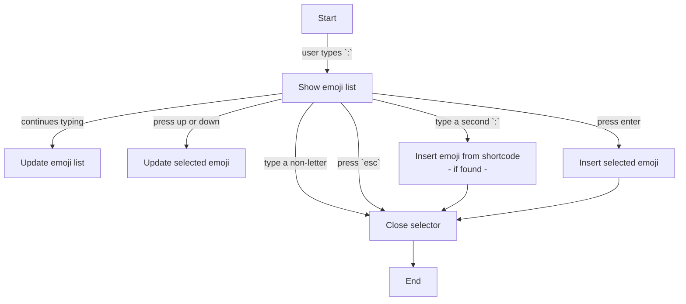

# Emoji on the go

A firefox extension to quickly insert emoji into text fields, using the :emoji_name: syntax.

# Development instructions

## prerequisites
- nodejs and npm
- windows

## steps
1. Clone the repository or unzip emoji-src.zip
2. run `npm install`
3. run `npm start` to start the development server
4. Load as a temporary addon in firefox
5. open `http://localhost:3000/test-site.html` to test the extension

## build instructions
1. run `npm run build`

``./build/emoji.zip`` is the built extension and ``./build/emoji-src.zip`` is the source code

# Behaviour on any editable field

# Developer's corner
## ``Handler`` classes
Handlers are classes handling all the logic between the selector's UI, the website to act on and the user's actions.

Two base handlers are already available and provide base logic that is valid for every use cases. If you want to add 
support for a specific website or an input method that is not handled by default, you will need to write a handler 
based on one of those two base Handlers. Depending on your use case, you will extend either `Handler` or `EditableHandler`

- `Handler` is the minimal base class that have a few predefined logic, only to ensure the behaviour of the extension 
is respected. Here is what you can use to fulfill your needs :

```typescript

/** 
 * Here are the public or protected fields and methods from base class that you can use for your specific case : 
 */
class Handler<TypeOfTarget> {

    /** These are useful properties and objects accessible from MyHandler that you can use */
    // The EmojiSelector object can be used to act on the selector's interface
    protected es: EmojiSelector
    // This is the targeted element, the one in wich the emoji should be injected
    // and the one from where most of the events come from
    protected target: TypeOfTarget
    protected searchResults: Emoji[]
    // changing this vcalue will automatically update search results
    protected search: string
    // active = listeners on, react to inputs and with interface displayed (in most of the cases)
    // inactive = waiting to be reactivated or destroyed. keep the instance alive.
    protected active: boolean
    
    
    /**
     *  methods 
     */
    
    /** select the currently focused emoji */
    protected selectEmoji() {}
    /** select the given emoji */
    protected selectEmoji(emoji: Emoji) {}
    protected dismissSearch(reason: string) {}

    /**
     * do pretty logs, useful for debugging.
     * @param message - displayed with formatting and all
     * @param title - dispalyed as the title of the console group
     * @protected
     */
    protected log(message: any, title: string = "") {}
    
    /**
     * will destroy the instance. Every listeners and references should be freed
     * so that garbage collector can do his job.
     * fire the onDestroy callback
     */
    destroy() {}
    
}

/**
 * This base handler provide logic for handling editable fields.
 * it contains these additional properties and methods :
 */
abstract class HTMLEditableHandler<TypeOfTarget> extends Handler<TypeOfTarget> {

    /**
     * Here are the public or protected fields and methods from base class that you can use for your specific case :
     */
    protected searchPosition: {
        begin: number,
        end: number,
        caret: number
    }

    /**
     *  methods
     */

    /**
     *  callbacks
     */
}


class MyHandler extends HTMLEditableHandler<TypeOfTarget> {

    /** these three fields are used to select the handler that will be best to use in a particular
    context (website and type of target).
    you need to declare them before anything else */
    static sites: string[] = ["array of specific websites your extension support. Leave empty for all wabsites"]
    static targets: string[] = ["array of tag names that your extension support. Leave empty for every elements"]
    static HandlerName: string = "A pretty name for your handler"
    
    /** this function will be called for you to confirm that this handler can work with the target,
     before giving you the lead. */
    static canHandleTarget(target: TypeOfTarget): boolean {}

    /**
     * Here are the callbacks that you can implement.
     * Most of them have a default behaviour that you can modify.
     * Others are mandatory to implement
     */
    
    onEnabled() {}
    onDisabled() {}
    
    onEmojiSelected(emoji: Emoji) {} // mandatory
    onShortcodeDetected(shortcode: string): Emoji | null {}
    onSearchUpdated() {}
    onSearchDissmissed(reason: string) {}
    
    /** mandatory. Here you need to clean up every references and listeners to enable garbage collection */
    onDestroy() {}
    
}


```


.