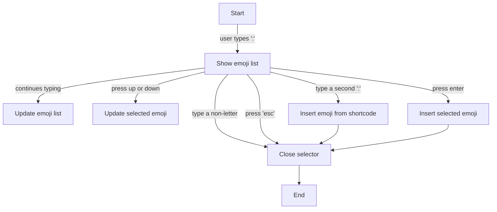

# Emoji on the go

A firefox extension to quickly insert emoji into text fields, using the :emoji_name: syntax.

# Development instructions

## prerequisites
- nodejs and npm
- windows

## steps
1. Clone the repository or unzip emoji-src.zip
2. run `npm install`
3. run `npm start` to start the development server
4. Load as a temporary addon in firefox
5. open `http://localhost:3000/test-site.html` to test the extension

## build instructions
1. run `npm run build`

``./build/emoji.zip`` is the built extension and ``./build/emoji-src.zip`` is the source code

# Behaviour on any editable field

# Developer's corner
## building extension
the ./build.bat script allows you to build the extension in a zip file, and zip the sources. If you provide
a version number as the -v argument, it will create commit and a tag and then push to remote.

## API description
### `EmojiSelector` class
This class is an interface to the selector's UI. It is used to interact with the user and display the emoji list.
#### Properties
- `onEmojiSelected: (emoji: Emoji) => void` : a callback that will be called when an emoji is selected
- `searchResults: Emoji[]` : the list of emojis that are currently displayed
- `disply: boolean` : whether the selector should be shown or not
- `position: {position: { x: number; y: number; }, positioning: "up" | "down"}` : the position of the selector, and 
whether it should be displayed above or below the target element
- `debugText: string` : a text that will be displayed in the selector for debugging purposes
#### Methods
- `focusUp()` : move the focus up in the emoji list
- `focusDown()` : move the focus down in the emoji list
- `getFocusedEmoji(): Emoji` : return the emoji that is currently focused
- `setFocusedEmoji(index: number)` : change the focused emoji in the list

### Utilities
package : `./src/selector/selctor-utils.ts`

this package contains utility functions that you can use in your handlers.
- `function getRelativeVerticalPositioning(y: number) :"up" | "down";` : return whether the selector should be displayed
above or below the target element, based on the vertical position of the target element
- `function getRelativeVerticalPositioning(element: Element) :"up" | "down";` : same but calculate it directly from the
element
- `function calculateXYFromElt(elt: Element, positioning: "up" | "down" | "auto" = "auto"): {x: number, y: number}` :
 return the absolute position of the selector based on the target element and the positioning parameter
- `function getAbsoluteCaretPosition(element: HTMLTextAreaElement) : {x: number, y: number, lineH: number}` : 
return the absolute position of the caret in the given textarea
- `function getPositionFromElement(elt: HTMLInputElement | HTMLTextAreaElement)` -> you should use this
- `function getPositionFromTextareaCaret(elt: HTMLTextAreaElement)` -> same but for textareas.
return type : `{position: { x: number; y: number; }, positioning: "up" | "down"}`

### `Handler` classes
Handlers are classes handling all the logic between the selector's UI, the website to act on and the user's actions.

Two base handlers are already available and provide base logic that is valid for every use cases. If you want to add 
support for a specific website or an input method that is not handled by default, you will need to write a handler 
based on one of those two base Handlers. Depending on your use case, you will extend either `Handler` or `EditableHandler`
#### `Handler` base class
`Handler` is the minimal base class that have a few predefined logic, only to ensure the behaviour of the extension 
is respected. Here is what you can use to fulfill your needs :
##### `Handler` properties
- `es: EmojiSelector` : the selector's UI
- `target: EltType` : The targeted element. EltType changes with the different types of handlers
- `instanceId: number = Date.now()` used for logging purposes
- `search: string` Changing the value of this attribute will update de search results displayed to user
- `active: bool` Whether the selector is active or not. Exact behaviour may depend on the type of handler, but a disabled
  handler must hide the selector and not interfere with the user's input, only stay with memory of what was there before.
  the handler is always disabled before destroyed
- `searchResults: Emoji[]`

##### `Handler` methods
- `selectEmoji(emoji?: Emoji)` Call this to insert the given or currently focused emoji. will trigger `onEmojiSelected`
- `dismissSearch(trigger: string)` Dismiss the searching (by default, destroy the selector and handler). Will trigger `onSearchDismissed`
- `destroy()` Destroy the handler and the selector. Will trigger `onDestroy`

##### `Handler` callbacks, events and methods to overload (do not call them directly)
- `getSelectorPosition(): {position: { x: number; y: number; }, positioning: "up" | "down"};` *(mandatory)* :
return the absolute positioning of the selector
- `onEmojiSelected(emoji: Emoji): void` *(mandatory)* : actions to do when an emoji is selected by the user
- `onDestroy(): void` *(mandatory)* : actions to do (clean up every listener, refs and close selector to allow garbage collection of the handler)
- `onDisabled(): void`
- `onEnabled(): void`
- `onShortcodeDetected(sc: string)` : Default : call `selectEmoji(em)` with the emoji corresponding to the shortcode
- `onSearchUpdated()` : Default : look for shortcodes or invalid search patterns and display the results
- `onSearchDismissed(trigger: string)` : `trigger` is the reason why the search has been dismissed. Default: destroy the handler
- `onFocusLost()` : Default : `this.dismissSearch("FOCUS_LOST")`

#### `EditableHandler` base class (extends `Handler`)
In addition to the base `Handler` class API, you will find here additional logic to make the selector work on editable fields
(what you will do 99% of the time)

The `EditableHandler` includes a search positioning which indicates the position of the user's search, a default behavior for 
`onEmojiSelected` and many additional methods that provides the basics of handling emoji inputs in text fields.

You can find three implementations of this handler : `HTMLInputHandler`, `TextAreaHandler` and, more complex, `AriaDivHandler`.
##### `EditableHandler` properties
-  `searchPosition: {
   begin: number,
   end: number,
   caret: number
   }` The search position inside the text field (correspond to the indexes in the string returned by `getFieldValue`)

##### `EditableHandler` methods
- `insertEmoji(emoji: Emoji)` : insert the given emoji in the target.
- `getSelectionPosition(): {start: number, end: number, direction: string}` return the caret (or selection range) position in the field.
useful to override when you're not working on standard text fields
- `getSearchPosition(): {begin: number, end: number, caret: number}` return the search position taking in account everything that may change the search position
  (it uses by default the selection position, see implementation for more details)
- `getFieldValue(): string` 
- `getSearchValue(): string`

- `handleSelectionChange(e: Event)` Called when something move in the field to do the necessary to update the search. *The implementation is just good the way it is, **if you want to change something override the more precise functions mentioned above***.
However, it can be useful th change the way it is called in the constructor (for example change the event to listen to).

##### `EditableHanler` others callbacks, events and methods to overload (in addition to the ones from `Handler`)
- `onDestroy` **is still mandatory to implement when extending `EditableHandler`**

*`v-2.2.0`*
