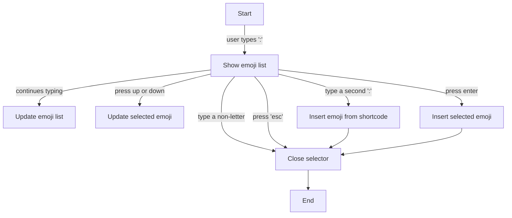

# Emoji on the go

A firefox extension to quickly insert emoji into text fields, using the :emoji_name: syntax.

# Development instructions

## prerequisites
- nodejs and npm
- windows

## testing the extension
1. Clone the repository or unzip emoji-src.zip
2. run `npm install`
3. in webpack.config.js, change the `firefox` and `firefoxProfile` properties of the WebExtPlugin to match your local installations
4. run `npm start` and  `npm watch-extensions` to start the development server and the development instance of firefox
5. You can open [http://localhost:8080/test-site.html](http://localhost:8080/test-site.html) to test the extension

# Behaviour on any editable field

```mermaid
graph TD
    A[Start] -->|user types ':'| B[Show emoji list]
    B -->|continues typing| C[Update emoji list]
    B -->|press up or down| F[Update selected emoji]
    B -->|press enter| G[Insert selected emoji]
    B -->|type a non-letter| E[Close selector]
    B -->|press 'esc'| E[Close selector]
    B -->|type a second ':'| D[Insert emoji from shortcode]
    D --> E
    G --> E
    E --> J[End]
```

